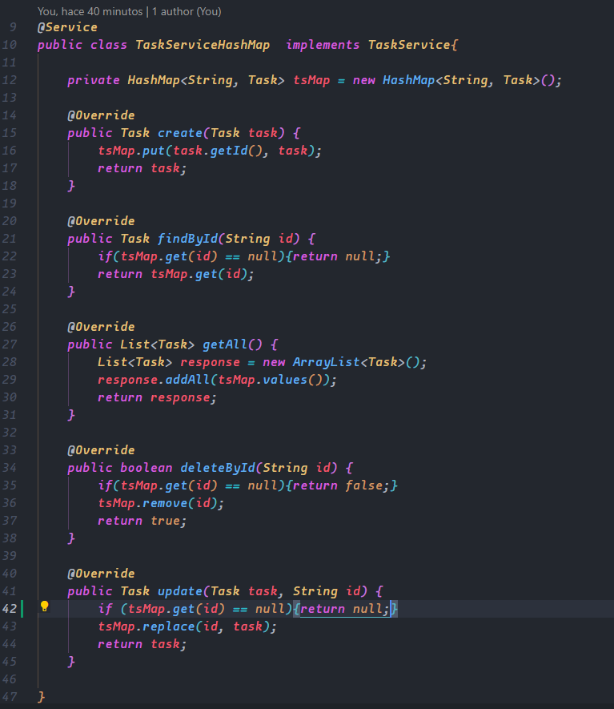

# Author: José Manuel Gamboa Gómez

## Part 2: Implementing the Tasks Microservice RESTFUL API

2. Create a new package called dto and inside define your TaskDto object with at least the following fields

    

    

3. Create a new package called entities and inside define your Task entity object with the same fields as the dto version:

    

    

4. Create a new package called service and inside create the following interface

    

    

5. Create an implementation of the TaskService using a HashMap data structure inside and make sure your service implementation TaskServiceHashMap is injectable using the @Service annotation.

    

